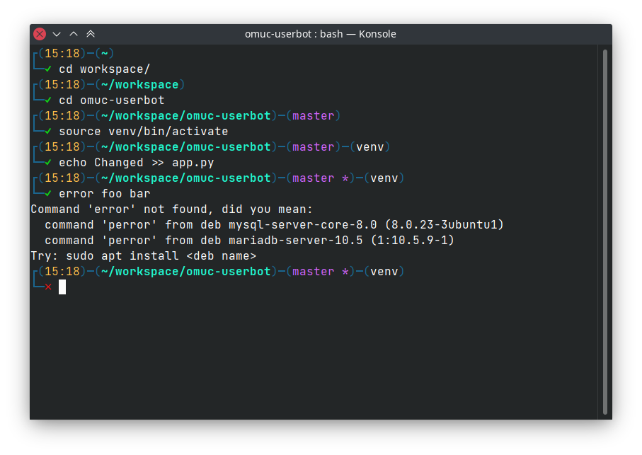

# My new bash prompt


Shows:
 * current directory
 * git branch and dirty state
 * currently used *venv*
 * a red cross if last command failed

To show current username and host just uncomment some lines from prompt.sh

## Install
Install script is not tested yet, do
```
./install.sh
```
And please notify me if that worked.

## TODO list
* [ ] Set max size to pwd so that it doesn't overflow the first line

## Uninstalling
Currently This tool doesn't have uninstall script :sweat_smile:.
Feel free to PR.

## Contributing
Any issues and pull requests are welcome (though the latter is preferred)
